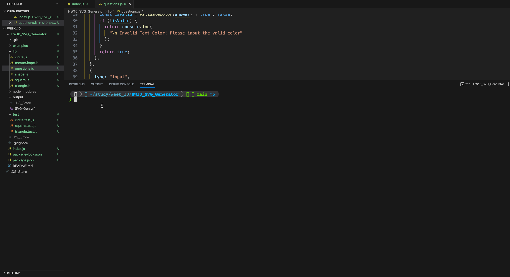

<h1 align="center">README.md SVG Logo Generator </h1>
   
## Description
  
🔍 A node.js application that uses user input from inquirer to create an SVG Logo file. The logo files of different shapes are created in the examples directory and can be found [here](./examples/logo-cir.svg)  
This application also demonstrates the Tests executed for each shape. 
For validating the color, this project uses package provided by npm called validate-color.
  
💻 Below is the gif showing the functionality of the application:
  

  
The full movie file showing functionality of the application can be found [here](./video/SVG_GENERATOR.webm)  
  
## User Story
  
```
AS a freelance web developer
I WANT to generate a simple logo for my projects
SO THAT I don't have to pay a graphic designer
```
  
## Acceptance Criteria
  
``` 
GIVEN a command-line application that accepts user input
WHEN I am prompted for text
THEN I can enter up to three characters
WHEN I am prompted for the text color
THEN I can enter a color keyword (OR a hexadecimal number)
WHEN I am prompted for a shape
THEN I am presented with a list of shapes to choose from: circle, triangle, and square
WHEN I am prompted for the shape's color
THEN I can enter a color keyword (OR a hexadecimal number)
WHEN I have entered input for all the prompts
THEN an SVG file is created named `logo.svg`
AND the output text "Generated logo.svg" is printed in the command line
WHEN I open the `logo.svg` file in a browser
THEN I am shown a 300x200 pixel image that matches the criteria I entered
```
  
## Table of Contents
- [Description](#description)
- [User Story](#user-story)
- [Acceptance Criteria](#acceptance-criteria)
- [Table of Contents](#table-of-contents)
- [Installation](#installation)
- [Usage](#usage)
- [Contributing](#contributing)


## Installation

`npm init`

`npm install inquirer@8.2.4`

`npm install jest`

## Usage

Run the following command at th root of your project and answer the prompted questions:

`node index.js`

## Contributing

- [Nidhi Shah](https://github.com/shahnidhi20/)
